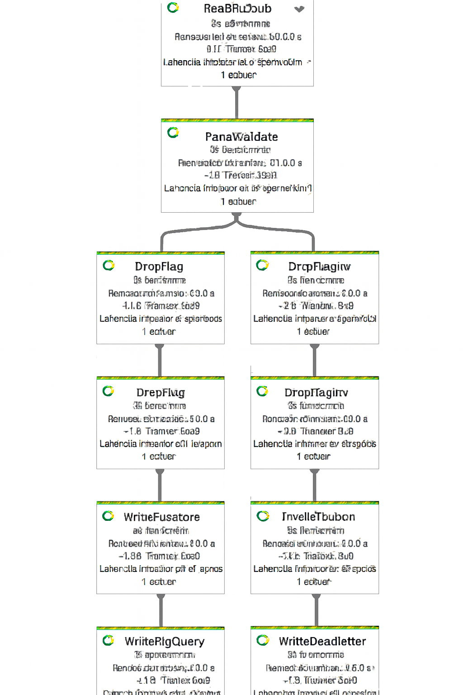
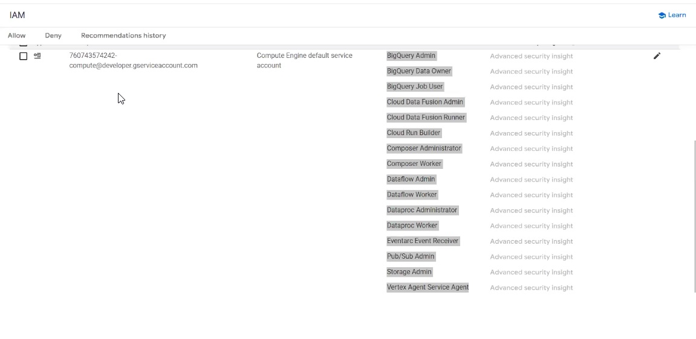

# 🛴 VoltGo Scooter Stream - GCP Data Pipeline en Tiempo Real

## 📖 Contexto del Proyecto
VoltGo es una empresa operadora de scooters eléctricos en rápida expansión. Inicialmente, el análisis de datos se realizaba mediante procesos *batch*, lo que provocaba latencia operativa y retrasaba las alertas críticas sobre el estado de la flota. 

Este proyecto implementa una **arquitectura basada en eventos (streaming)** para proveer visibilidad inmediata a las áreas de Operaciones y Compliance. La solución permite trazabilidad a nivel de evento crudo y analítica en tiempo casi real para mitigar riesgos y mejorar la toma de decisiones.

---

## 🛠️ Stack Tecnológico
* **Lenguaje:** Python 3.11
* **Procesamiento de Datos:** Apache Beam
* **Google Cloud Platform (GCP):**
  * **Ingesta:** Cloud Pub/Sub
  * **Motor Streaming:** Cloud Dataflow
  * **Capa Operativa (NoSQL):** Firestore (Modo Nativo)
  * **Data Warehouse:** Google BigQuery
  * **Seguridad:** Cloud IAM (Identity and Access Management)

---

## 🏗️ Arquitectura y Flujo de Datos
El pipeline fue construido utilizando servicios administrados de GCP:
1. **Ingesta:** Un script publica datos de telemetría de scooters desde un CSV hacia un tópico de Pub/Sub.
2. **Transformación:** Un pipeline de Dataflow evalúa, valida (tipado fuerte) y transforma los mensajes JSON al vuelo.
3. **Distribución Dual:** * Los eventos válidos se escriben en **Firestore** para operaciones de lectura ultrarrápida (por `event_id`).
   * Simultáneamente, se insertan en **BigQuery** (`STREAMING_INSERTS`) para analítica histórica.
4. **Manejo de Errores (DLQ):** Los registros inválidos se redirigen a un tópico *Deadletter* en Pub/Sub, evitando interrupciones en el flujo principal.

---

## 📊 Evidencias de Ejecución

### 1. Grafo del Pipeline (Dataflow)
El DAG muestra la bifurcación lógica entre la ruta de éxito (Firestore/BigQuery) y la ruta de fallo (Deadletter).

### 2. Métricas de Ejecución
Desempeño de los *workers* procesando los eventos en streaming y la latencia del sistema.

### 3. Resultados en BigQuery (Capa Gold)
Datos consolidados, tipificados y listos para ser explotados por herramientas de BI.

### 4. Seguridad y Gobernanza (IAM)
Configuración de roles y políticas de mínimo privilegio para la ejecución segura de los servicios involucrados.

---

## 📁 Estructura del Repositorio
* `/Data`: Archivos CSV de muestra (`sample_scooter_events.csv`).
* `/Docs`: Documentación técnica e informes de ejecución.
* `/Images`: Evidencias visuales de la arquitectura y resultados.
* `/Scripts`: 
  * `publish_csv_to_pubsub.py`: Simulador de eventos IoT.
  * `streaming_pipeline.py`: Pipeline principal en Apache Beam.
* `requirements.txt`: Dependencias del entorno de Python.

---
## Stack Tecnologicos

**Creado por:** Angel Teodoro Jaramillo Sulca  
**Rol:** Data Engineer  
**Contacto:** [LinkedIn / GitHub](https://github.com/Angeljs094)

---